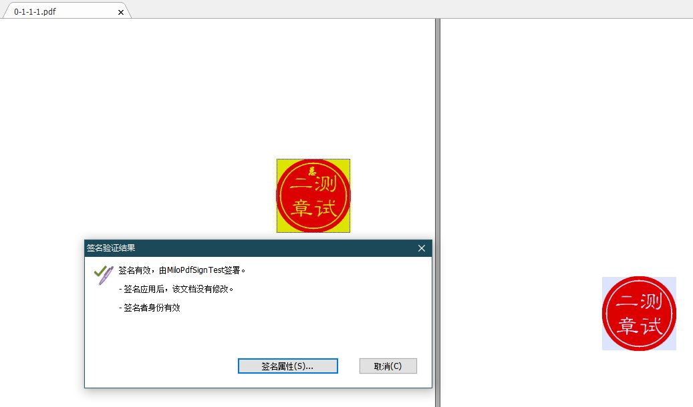
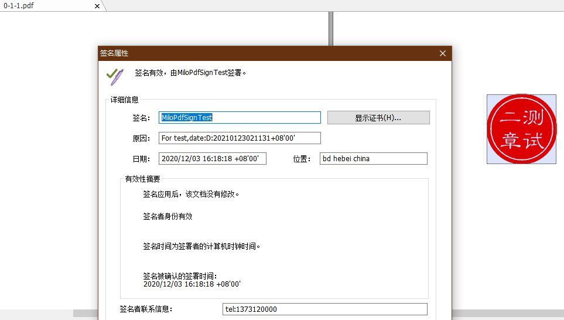

# Milo-Pdf-Sign

一套给PDF文件增加电子签名的工具包

## 介绍

Milo Pdf Sign是一套给PDF文件增加电子签名的工具包，包含签名增加工具，PDF文件结构查看工具，PDF文件拆分工具，PDF压缩Stream解压工具。

## 特点

1. 闭源独立开发，拥有著作权。
2. 基于ISO PDF标准由.net C#实现，可集成到Sass服务中去。兼容性好，增加的签名在常见PDF阅读器下均可识别。
3. 基于ISO PDF标准，可以独立定义PDF内部标记，增加内部隐含标记，而不使用通用标记如：“iText-1.0.0”。

## 演示

1. 增加一个签名，是一张图片附带电子签名。信息显示文件被保护，没有人恶意修改。

2. 查看签名具体内容。包含电子签名内容。

## 演示PDF文件

- 有些浏览器不支持查看pdf文件中包含的电子签名。遇到这种情况，请下载使用常用PDF查看器，如《Adobe Acrobat》《福昕pdf阅读器》《WPS Office》等等软件查看电子签名内容。

[演示1PDF文件，](demos/demo1.pdf)

[演示2PDF文件](demos/demo2.pdf)

## 官网

[milopdf](https://gitee.com/xinghuo4096/Milo-Pdf-Sign)

## 联系作者

- 262066859@qq.com
